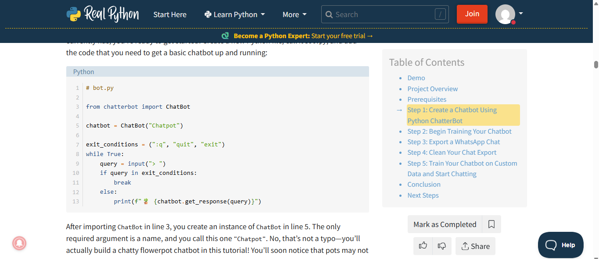
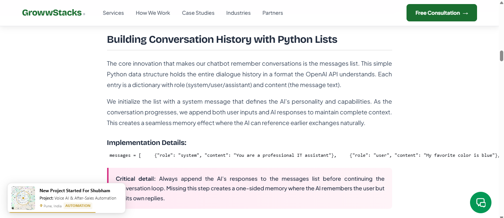
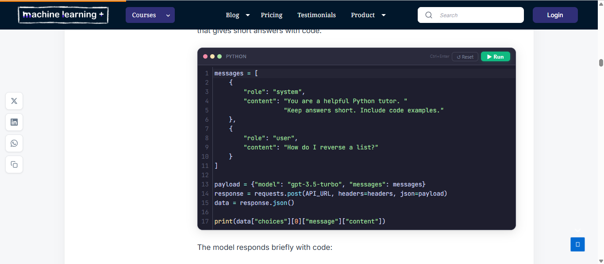

# Learning AI Logic: 

The skill is developing a Chatbot System – more specifically the AI logic element and the system pipeline. 

## Motivation  

My motivation for learning this skill came from an interest in understanding how modern AI systems, particularly chatbots, actually work beyond just using them. I wanted to develop a foundational understanding of prompt engineering and AI system structure, as I recognised this as an increasingly important area in both computing and wider industry. 

I was particularly interested in how user input is transformed into structured prompts and how the conversion works. This is something that is often hidden behind user interfaces but is central to how systems like Gemini and ChatGPT operate. By learning this, I aimed to move from being a user of AI tools to someone who understands how they are built and structured. 

This also aligned with my role in the group project, where I was responsible for developing the conversation logic and AI integration. This required me to understand not just theory, but how to apply it in a practical Python-based system. I wanted to develop this as a technical skill, specifically learning how to design and implement an AI pipeline that processes input then builds prompts and then generates responses. 

In the long term, I believe this skill will be valuable as AI becomes more integrated into software systems. Understanding prompt engineering and chatbot architecture provides a strong foundation for future work in areas. It also improves problem-solving skills, as it requires structuring systems clearly and thinking about how data flows between components. 

 

## Background  

This guide is aimed at students or, more generally, learners with basic Python knowledge who are new to AI systems and chatbot development. Before starting, it is important to understand what a chatbot is and how these systems operate at a general level. 

A useful overview is provided here: 

https://builtin.com/artificial-intelligence/what-is-a-chatbot 

This explains that chatbots simulate human conversation and are commonly used in areas like customer service and digital assistants. It also shows that modern chatbots are often powered by AI models, rather than relying only on fixed responses. 

This is an image of famous chatbot ChatGPT, and how it operates:

.png)

The BuiltIn resource also explains that chatbots can be rule-based or AI-based. Rule-based systems use predefined responses, while AI-based systems generate responses dynamically. 

In practice, many systems combine both. Simple cases are handled with rules, while more complex inputs are handled by AI. This shows that chatbot design is about structuring how responses are produced, not just writing them. 

 

To understand how chatbots function in practice, this website introduces the idea of interaction flow: 

https://realpython.com/build-a-chatbot-python-chatterbot/ 

This website will be used later as a learning material, however for now, it simply shows that chatbots operate through continuous interaction, where input is received and a response is produced repeatedly. This highlights that a chatbot is not a single action, but an ongoing system. 

From this, it becomes clear that chatbots follow a structured process, often referred to as a pipeline. At this stage, it is not necessary to understand each part in detail, only that input is passed through a series of steps to produce a response. 

## Learning Materials 

To develop this skill, the focus is on understanding how chatbot systems are structured rather than copying full implementations. The goal is to recognise patterns used in real systems and apply them in a simplified way. 

These resources build on the idea of a pipeline introduced in the background, gradually breaking it into clearer stages. 

 

### Real Python - Build a Chatbot with Python 

https://realpython.com/build-a-chatbot-python-chatterbot/ 

This same site shows how chatbot systems are structured around continuous interaction. It shows that input is repeatedly received, broken down, processed, and then after responded to within a loop. 

This helps place the pipeline into context. Each loop represents one pass through the system, where input moves through several steps before producing a response. 

It also shows that input handling and response generation are separate parts of the system, which is important when structuring more complex designs. 

 

### GrowwStacks - Build a Memory-Powered AI Chatbot in Python: Complete 2026 Guide 

https://growwstacks.com/blog/python-chatbot-tutorial-build-ai-from-scratch/ 

This resource explains how chatbots store conversation history. It shows that previous messages must be saved manually, usually using simple data structures. 

This builds on the pipeline by introducing memory. Instead of each interaction being separate, past messages are reused to maintain context. 

It highlights that AI systems do not remember anything unless memory is included as part of the process. 

 

### Machine Learning Plus - Build an AI Chatbot with Memory in Python (2026) 

https://machinelearningplus.com/gen-ai/python-ai-chatbot-memory/ 

This site expands on the previous resource by showing more of how memory can be used in practice and the way it can be integrated into code. It explains that conversation history is included in every request sent to the model. 

This makes memory part of the input rather than something separate. It shows how earlier messages directly influence later responses, which is essential for maintaining context. 

Machine Learning Plus also shows you how prompts are structured. Instead of sending raw input, systems build a formatted prompt that includes instructions, history, and the current message. 

This is where the pipeline becomes more defined. Input is transformed before being used, rather than passed directly to the model. 

### Overall Features:

Across all of these materials, the same pattern appears: 

User Input → Processing → Prompt → Response → Memory Update 

The key skill is understanding how these stages connect. This structure is what allows chatbot systems to function and is consistent across real AI systems, allowing you to begin forming your own ai logic functions based of this pipeline.  

 

## Evaluation  

Learning how to design a chatbot pipeline and code AI logic is an important and valuable skill, especially for students interested in AI and software development. It provides a clear understanding of how modern AI systems work beyond simply using existing tools. 

These skills are very useful. Many systems rely on structured pipelines to process input and generate output, not just chatbots. Understanding how prompts are built and how memory is managed gives insight into how AI systems operate more generally. 

The effort required is moderate. You do not need advanced maths skills, but it does require clear thinking about how systems are structured. The main challenge is understanding how different parts connect rather than implementing them individually. 

Although there are simpler alternatives, such as using frameworks or no-code tools. These allow chatbots to be built quickly but hide how the system works. However, while they are useful for basic applications, they do not develop a deeper understanding of AI structure, therefore making the skills in this guide worthwhile to learn. 

Another comparison is between rule-based and AI-based systems. Rule-based systems are easier to create but limited in flexibility. AI-based systems are more adaptable but require understanding of prompt structure and system design. Using this guide allows you to learn the pipeline approach giving you the option for both types to be combined. This reflects how real systems are built and makes the skill more useful long term. 

One consideration may be that it may be worth learning more about how to do machine learning and directly train your own model version with some form of data. This is also a useful skill, that I may learn in the future but left out of my project and guide with consideration for simplicity. However, the lack of AI model training does limit things when implementing any AI system created with this guide and may be considered a weakness of the skills focussed on.  

Overall, I found that the effort was worth learning AI logic and pipelining. Despite not providing a full picture on all sides of AI such as model training, it gives a deeper and more transferable understanding of AI systems, making it particularly useful for learners progressing to university-level computer science or AI. 
